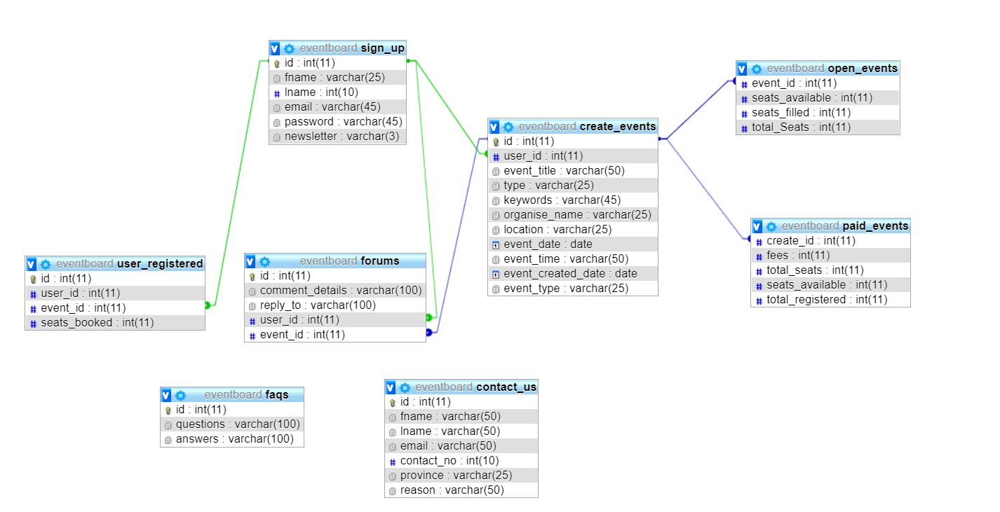

<<<<<<< HEAD
<<<<<<< HEAD
# PHP_PROJECTS
=======
## Project Title
EventBoard Management System

## Please run eventsboard.sql script in databases folder before opening the pages 

## Description
<ul>
	<li>This is a website for all kinds of events ranging from small events to large events.</li>
	<li>Popular for smaller events or meetup events.</li>
	<li>You can use it to send email confirmations and reminders.</li>
	<li>User can go register to free events or paid events.</li>
</ul>

## Web Hosting Absolute URl 
http://eventboard.000webhostapp.com/

## Working
The project starts executing with the home page which is Index.php.
admininterface.php works when the event database(script included) is created. 

## Work Done By

	### Abhiroop Singh
		Admin Panel   
		-AdminContact.php
		-AdminINterface.php
		-Create.php  (only works on localhost)
		-CreateUserAdmin.php
		-Reset.php
		-Resetmessage.php
		-Update.php  ---when you click modify in admininterface.php (only works on localhost)
		-UserAdmin.php
		-dbHelper.php
		-Forgot.php (Only Works on WebHost)

	### Zenil Soni 
		Login Page , Signup Page, About Us , Create Event page- 
		-Login.php
		-Signup.php
		-createEvent_Page1.php
		-CreateEvent_Page2.php
		-AboutUs.php
		-ValidateUserForm.php
		-dbHelper.php
		-deleteAcc.php
		-HeaderUser.php
		-SessionDestroy.php
		-ShowEvents.php
		-updateAcc.php
		-usernav.php
		-userside.php
		-validateEvents.php
		-ValidateUserForm.php

	### Minal Patel
		Home Page, Selecting Event and Registering Event, FAQs, File Integration, Contact Us page  
		-Contact.php
		-ContactThankyou.php
		-ContactUs.php
		-DeleteContact.php
		-Event.php
		-FAQs.php
		-Footer.php
		-Header.php
		-index.php
		-RegisterThankyou.php
		-UpdateContact.php
		-User.php

## Database Design

## Requirements For Home Page and FAQs page
Sql file provided named eventboard.sql amd important to be executed in Mysql so as to excute the Home page, User Registering in event page and FAQ page without any issues and problems.

>>>>>>> Eventboard Website
=======
## Project Title
EventBoard Management System

## Please run eventsboard.sql script in databases folder before opening the pages 

## Description
<ul>
	<li>This is a website for all kinds of events ranging from small events to large events.</li>
	<li>Popular for smaller events or meetup events.</li>
	<li>You can use it to send email confirmations and reminders.</li>
	<li>User can go register to free events or paid events.</li>
</ul>

## Web Hosting Absolute URl 
http://eventboard.000webhostapp.com/

## Working
The project starts executing with the home page which is Index.php.
admininterface.php works when the event database(script included) is created. 

## Work Done By

	### Abhiroop Singh
		Admin Panel   
		-AdminContact.php
		-AdminINterface.php
		-Create.php  (only works on localhost)
		-CreateUserAdmin.php
		-Reset.php
		-Resetmessage.php
		-Update.php  ---when you click modify in admininterface.php (only works on localhost)
		-UserAdmin.php
		-dbHelper.php
		-Forgot.php (Only Works on WebHost)

	### Zenil Soni 
		Login Page , Signup Page, About Us , Create Event page- 
		-Login.php
		-Signup.php
		-createEvent_Page1.php
		-CreateEvent_Page2.php
		-AboutUs.php
		-ValidateUserForm.php
		-dbHelper.php
		-deleteAcc.php
		-HeaderUser.php
		-SessionDestroy.php
		-ShowEvents.php
		-updateAcc.php
		-usernav.php
		-userside.php
		-validateEvents.php
		-ValidateUserForm.php

	### Minal Patel
		Home Page, Selecting Event and Registering Event, FAQs, File Integration, Contact Us page  
		-Contact.php
		-ContactThankyou.php
		-ContactUs.php
		-DeleteContact.php
		-Event.php
		-FAQs.php
		-Footer.php
		-Header.php
		-index.php
		-RegisterThankyou.php
		-UpdateContact.php
		-User.php

## Database Design

## Requirements For Home Page and FAQs page
Sql file provided named eventboard.sql amd important to be executed in Mysql so as to excute the Home page, User Registering in event page and FAQ page without any issues and problems.

>>>>>>> Eventboard Website
